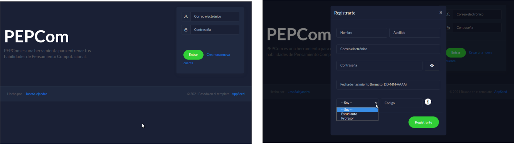
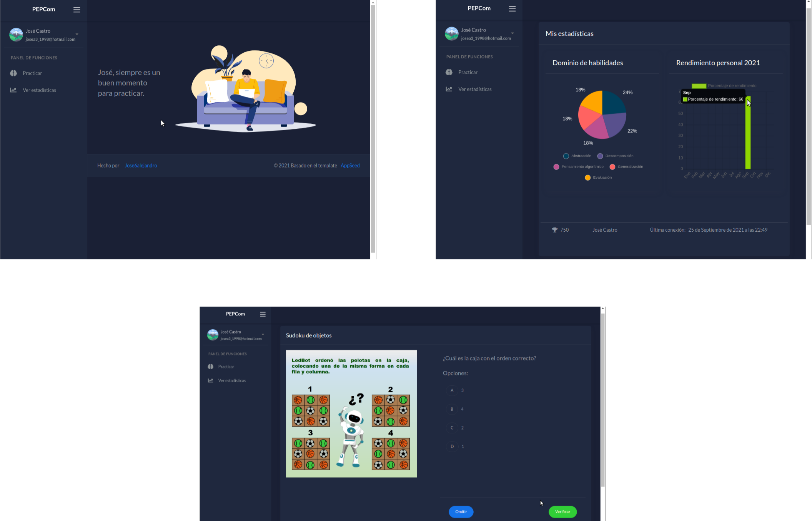

# EPCom
una aplicación para Entrenar el Pensamiento Computacional (EPCom)

## Configuración
### Instalar repositorio
```bash
$ git clone https://github.com/jose6alejandro/EPCom.git
```
### Instalar requisitos
```bash
$ cd EPCom/
$ pip3 install -r requirements.txt
```
## Ejecución
```bash
$ python3 EPCom/manage.py runserver # default port 8000
```
## Abrir en el navegador 
http://localhost:8000

## Acceso a la práctica de prueba creada (estudiante)
Código: PR1-ULA

## Abrir cuestionario de usabilidad
https://forms.gle/GNoKSRKJ3v3QofqW6

## Algunas capturas

### 1. Acceso


### 2. Estudiante


### 3. Profesor


